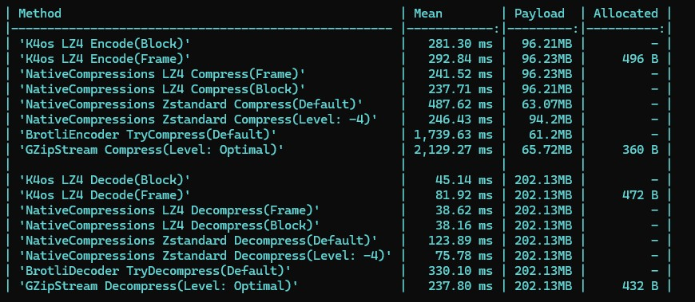

NativeCompressions
===
<!-- [](https://github.com/Cysharp/NativeCompressions/actions/workflows/build-debug.yaml)
[](https://www.nuget.org/packages/NativeCompressions) -->

NativeCompressions provides native library bindings and streaming processing for [LZ4](https://github.com/lz4/lz4) with its excellent decompression speed, and [Zstandard](https://github.com/facebook/zstd) with its superior balance of compression ratio and performance, and new [OpenZL](https://github.com/facebook/openzl) novel data compression framework.



> Encode/Decode [silesia.tar](https://en.wikipedia.org/wiki/Silesia_corpus) corpus(202.13MB)

Compression is crucial for any application, but .NET has had limited options. NativeCompressions builds state-of-the-art algorithms (LZ4, Zstandard) with stream-less streaming APIs. Furthermore, by leveraging modern C# APIs (`Span<T>`, `PipeReader/Writer`) to provide high-level asynchronous APIs, we achieve high-performance compression in any environment.

We chose native bindings over Pure C# implementation because compression library performance depends not only on algorithms but also on implementation. LZ4 and Zstandard are actively developed with performance improvements in every release. It's impossible to keep synchronizing advanced memory operations and CPU architecture optimizations with .NET ports. To continuously provide the best and latest performance, native bindings are necessary. Compressors also involve intricate memory arithmetic, so staying on the official implementation matters for keeping up with the latest security fixes. Note that .NET's standard `System.IO.Compression.BrotliEncoder/Decoder` links [brotli](https://github.com/dotnet/runtime/tree/main/src/native/external/brotli) to [libSystem.IO.Compression.Native](https://github.com/dotnet/runtime/tree/main/src/native/libs/System.IO.Compression.Native), also DeflateStream/GZipStream uses native zlib (from .NET 9, it's [zlib-ng](https://github.com/zlib-ng/zlib-ng)), meaning we follow the same adoption criteria as .NET official. .NET 11 ships Zstandard as well, and that is a native binding too.

LZ4 and Zstandard are created by the same author [Cyan4973](https://github.com/Cyan4973), showing high performance against competitors in their respective domains (LZ4 vs Snappy / Zstandard vs Brotli), and are widely used as industry standards. Also, a new compression library called OpenZL was released in 2025 from Meta, where he works. NativeCompressions supports this excellent library as well (OpenZL is experimental though, with native bindings only and no NuGet package).

Getting Started
---
Install the package from [NuGet/NativeCompressions](https://www.nuget.org/packages/NativeCompressions):

```bash
# LZ4 + Zstandard, all platforms
dotnet add package NativeCompressions

# LZ4, all platforms
dotnet add package NativeCompressions.LZ4

# Zstandard, all platforms
dotnet add package NativeCompressions.Zstandard
```

The package includes native libraries for Windows (x64, arm64), Linux (x64, arm64), macOS (x64, arm64), Android (arm, arm64, x64), iOS and Mac Catalyst. The macOS libraries require macOS 15.0 or later.

`NativeCompressions` bundles everything. The smaller packages are for taking only one algorithm, or only some of the native libraries.

| Package | Contents |
|---|---|
| `NativeCompressions` | LZ4 and Zstandard, all platforms |
| `NativeCompressions.LZ4` / `NativeCompressions.Zstandard` | one algorithm, all platforms |
| `NativeCompressions.LZ4.Core` / `NativeCompressions.Zstandard.Core` | the managed binding only, no native libraries |
| `NativeCompressions.LZ4.Runtime` / `NativeCompressions.Zstandard.Runtime` | the native libraries of all platforms |
| `NativeCompressions.LZ4.Runtime.<rid>` / `NativeCompressions.Zstandard.Runtime.<rid>` | the native library of one platform. `<rid>` is one of `win-x64`, `win-arm64`, `linux-x64`, `linux-arm64`, `osx-x64`, `osx-arm64`, `android-arm`, `android-arm64`, `android-x64`, `ios-arm64`, `ios-x64`, `maccatalyst-x64`, `maccatalyst-arm64` |

For example, a Linux server that only needs Zstandard takes `NativeCompressions.Zstandard.Core` and `NativeCompressions.Zstandard.Runtime.linux-x64`.

iOS and Mac Catalyst apps need .NET 10 or later. The native libraries are linked statically on those platforms, and the assemblies that call them that way are built for `net10.0-ios` and `net10.0-maccatalyst` onward. An app that targets .NET 8 or 9 there fails at build time with a message saying so.

.NET Framework apps need an explicit architecture. When a .NET Framework exe sets neither `PlatformTarget` nor `RuntimeIdentifier`, the SDK restores it as `win-x86`, and the packages have no 32-bit library, so nothing is copied to the output and the first call throws `DllNotFoundException`. Set `<PlatformTarget>x64</PlatformTarget>` (or `arm64`) in the project, or `<RuntimeIdentifier>win-x64</RuntimeIdentifier>`, and the native library of that architecture is copied next to the exe. 32-bit processes are not supported.

```csharp
// for LZ4
using NativeCompressions;

// Simple compression
byte[] compressed = LZ4.Compress(sourceData);
byte[] decompressed = LZ4.Decompress(compressed);
```

```csharp
// for Zstandard
using NativeCompressions;

// Simple compression
byte[] compressed = Zstandard.Compress(sourceData);
byte[] decompressed = Zstandard.Decompress(compressed);
```

Install for Unity, see [Unity](#unity) section.

For how to use each one, please refer to the [LZ4](#lz4) section, the [Zstandard](#zstandard) section, and the [OpenZL](#openzl) section.

LZ4
---
LZ4 does not reach a very high compression ratio, but its decompression speed is outstanding. Raising the compression level improves the ratio, but Zstandard is the better choice for that kind of use. LZ4 has both [Block Format](https://github.com/lz4/lz4/blob/dev/doc/lz4_Block_format.md) and [Frame Format](https://github.com/lz4/lz4/blob/dev/doc/lz4_Frame_format.md). We adopt **frame format** for all APIs from the perspective of compatibility, security, and performance flexibility. External dictionary loading is also supported.

### Simple Compression

Simple API to convert from `ReadOnlySpan<T>` to `byte[]`, or write/read to/from `Span<T>`. These encode/decode in frame format, not block format. The overloads without options record the content size in the frame header. When `LZ4CompressionOptions` is passed, `ContentSize` decides: 0 records nothing, and a value has to be the exact length of the source.

```csharp
using NativeCompressions;

// ReadOnlySpan<byte> convert to byte[]
byte[] compressed = LZ4.Compress(source);
byte[] decompressed = LZ4.Decompress(compressed);

// ReadOnlySpan<byte> write to Span<byte>
var maxSize = LZ4.GetMaxCompressedLength(source.Length);
var destinationBuffer = new byte[maxSize];
var written = LZ4.Compress(source, destinationBuffer);
var destination = destinationBuffer[0..written];
```

These APIs can be customized by passing `LZ4CompressionOptions`, `LZ4DecompressionOptions`. When decompressing to `byte[]`, setting the `bool trustedData` argument to `true` will trust the `ContentSize` in the LZ4 frame header if present, pre-allocating the buffer for improved performance. When `false`, it processes in blocks to an internal buffer then concatenates, which is more resistant to attacks sending malicious data. Default is `false`.

### Low-level Streaming Compression

APIs similar to [BrotliEncoder](https://learn.microsoft.com/en-us/dotnet/api/system.io.compression.brotliencoder)/[BrotliDecoder](https://learn.microsoft.com/en-us/dotnet/api/system.io.compression.brotliencoder) in System.IO.Compression to encode and decode data in a streamless, non-allocating, and performant manner using the LZ4 frame format specification.

```csharp
using NativeCompressions;

// for example, use for IBufferWriter<byte>
IBufferWriter<byte> bufferWriter;

using var encoder = new LZ4Encoder();

// Compress chunks(invoke Compress multiple times)
foreach (var chunk in dataChunks) // dataChunks = byte[][]
{
    // get max size per streaming compress
    var size = encoder.GetMaxCompressedLength(chunk.Length);

    var buffer = bufferWriter.GetSpan(size);

    // written size can be zero, meaning input data was just buffered.
    var written = encoder.Compress(chunk, buffer);

    bufferWriter.Advance(written);
}

// Finalize frame. The size covers buffered data, the footer, and the header of an empty frame when nothing was compressed.
var footerWithBufferedDataSize = encoder.GetMaxFlushBufferLength(includingFooter: true);
var finalBytes = bufferWriter.GetSpan(footerWithBufferedDataSize);

// need to call `Close` to write LZ4 frame footer
var finalWritten = encoder.Close(finalBytes);

bufferWriter.Advance(finalWritten);
```

Method name is `Compress` not `TryCompress`, and returns size not `OperationStatus` because LZ4's native API differs from Brotli. The source is fully consumed, requiring destination to be at least MaxCompressedLength relative to source. On failure, the internal context state is corrupted, so it cannot be a Try... API and throws `LZ4Exception` on failure.

For decompression, use `LZ4Decoder`.

```csharp
// while(status != OperationStatus.Done && source.Length > 0)
OperationStatus status = decoder.Decompress(source, destination, out int bytesConsumed, out int bytesWritten);
source = source.Slice(bytesConsumed);
destination = destination.Slice(bytesWritten);
```

In `Decompress`, both source and destination can receive incomplete data. When `OperationStatus.Done` is returned, all data is restored. Otherwise, `NeedMoreData` or `DestinationTooSmall` is returned.

### High-level Streaming Compression

Using `CompressAsync` or `DecompressAsync`, you can stream encode/decode from `ReadOnlyMemory<byte>`, `ReadOnlySequence<byte>`, `Stream`, `PipeReader` or a file path to `PipeWriter`. While internally using `LZ4Encoder/LZ4Decoder`, a single method call optimally handles complex operations.

The destination `PipeWriter` can be passed directly or wrapped around a Stream to change where to write. When the reader of the destination completes before everything is written, the call throws `IOException`.

```csharp
// source is `ReadOnlyMemory<byte>`, `ReadOnlySequence<byte>`, `Stream`, `PipeReader` or `string`(file path)

// to Memory
using var ms = new MemoryStream();
await LZ4.CompressAsync(source, PipeWriter.Create(ms));

// to File
using var fs = new FileStream("foo.lz4", FileMode.Create, FileAccess.Write, FileShare.None, bufferSize: 1, useAsync: true);
await LZ4.CompressAsync(source, PipeWriter.Create(fs));

// to Network
using var fs = new NetworkStream(socket);
await LZ4.CompressAsync(source, PipeWriter.Create(fs));
```

When source is `ReadOnlyMemory<byte>`, `ReadOnlySequence<byte>`, a seekable `Stream` or a file path, the length is known up front. It is recorded in the frame header as the content size, and the block size is chosen from it. A non-seekable `Stream` and `PipeReader` have no known length, so the frame has no content size and the default block size is used.

```csharp
// Compression from File to File
await LZ4.CompressAsync("foo.bin", "foo.lz4");

// or from a FileStream, starting at its current position
using var source = new FileStream("foo.bin", FileMode.Open, FileAccess.Read, FileShare.Read, bufferSize: 1, useAsync: true);
using var dest = new FileStream("foo.lz4", FileMode.Create, FileAccess.Write, FileShare.None, bufferSize: 1, useAsync: true);
await LZ4.CompressAsync(source, PipeWriter.Create(dest));
```

Compression and decompression run on the calling task, one block at a time. Output that is ready is flushed to the destination before more input is awaited, so the APIs work over a connection where the other side waits for a reply.

Similarly for Decompress, source can be `ReadOnlyMemory<byte>`, `ReadOnlySequence<byte>`, `Stream`, `PipeReader` or a file path, and destination can be `PipeWriter`.

```csharp
using var ms = new MemoryStream();
await LZ4.DecompressAsync("foo.lz4", PipeWriter.Create(ms));

var decompressed = ms.ToArray();
```

Concatenated frames and skippable frames are all decoded, the same as `LZ4.Decompress` and `LZ4Stream`. Invalid data and input that ends inside a frame throw `LZ4Exception`.

### Stream
Compatible with System.IO.Stream for easy integration:

```csharp
// Compression stream
using var output = new MemoryStream();
using (var lz4Stream = new LZ4Stream(output, CompressionMode.Compress))
{
    await inputStream.CopyToAsync(lz4Stream);
} // Auto-close writes frame footer

// Decompression stream
using var input = new MemoryStream(compressedData);
using var lz4Stream = new LZ4Stream(input, CompressionMode.Decompress);
byte[] buffer = new byte[4096];
int read = await lz4Stream.ReadAsync(buffer);
```

Each `Write` and `Read` goes to the native codec once, the same as the streams in `System.IO.Compression`. The native codec keeps its own block buffers, so a small read or write costs one call of about 10 ns and no buffering is done in the stream itself. Code that processes many small pieces at once, a serializer for example, is better served by the `PipeWriter` based `CompressAsync` and `DecompressAsync`.

### Options
You can change `with` operator.

```csharp
var options = LZ4CompressionOptions.Default with
{
    CompressionLevel = 3,
    ContentSize = (ulong)source.Length
};
```

```csharp
// full-options
var options = new LZ4CompressionOptions
{
    CompressionLevel = 9,           // 0-12
    AutoFlush = true,               // Flush after each compress call
    FavorDecompressionSpeed = true, // Optimize for decompression
    BlockSizeId = BlockSizeId.Max4MB,  // Max64KB, Max256KB, Max1MB, Max4MB
    BlockMode = BlockMode.BlockIndependent, 
    ContentChecksumFlag = ContentChecksum.ContentChecksumEnabled,
    BlockChecksumFlag = BlockChecksum.BlockChecksumEnabled,
    ContentSize = (ulong)sourceData.Length, // Pre-declare size
    Dictionary = null // LZ4 Dictionary
};
```

### Dictionary Compression
Improve compression ratio for similar data. `LZ4Dictionary.Create` accepts any bytes, but only the last 64KB are used. LZ4 has no dictionary trainer of its own, so we recommend training the dictionary bytes from samples with `ZstandardDictionary.Train` and passing the result, as [lz4frame.h](https://github.com/lz4/lz4/blob/dev/lib/lz4frame.h) itself suggests in its dictionary compression section. LZ4 reads the Zstandard dictionary header as plain bytes and uses the trained content at its end. `ZstandardDictionary.Train` lives in the Zstandard package, which the `NativeCompressions` package includes.

```csharp
// Train dictionary bytes from samples, a little over 64KB is enough for LZ4
byte[] dictionaryData = ZstandardDictionary.Train(samples, sampleLengths, maxDictionarySize: 64 * 1024);

// Create dictionary from the trained bytes (any bytes work, for example the last 64KB of representative data)
using var dictionary = LZ4Dictionary.Create(dictionaryData, dictionaryId: 12345);

// Use dictionary for compression
byte[] compressed = LZ4.Compress(source, LZ4CompressionOptions.Default with { Dictionary = dictionary });

// Decompression with same dictionary
byte[] decompressed = LZ4.Decompress(compressed, LZ4DecompressionOptions.Default with { Dictionary = dictionary });

// Dictionary can be reused across multiple operations
using var encoder = new LZ4Encoder(LZ4CompressionOptions.Default with { Dictionary = dictionary });
```

### Block Compression
For raw LZ4 block compression without frame format:

```csharp
// Get max compressed size
var maxSize = LZ4.Block.GetMaxCompressedLength(source.Length);

// Compress block
var destination = new byte[maxSize];
var compressedSize = LZ4.Block.Compress(source, destination);
var compressed = destination.AsSpan(0, compressedSize).ToArray();

// Decompress block
destination = new byte[source.Length];
var decompressedSize = LZ4.Block.Decompress(compressed, destination);
var decompressed = destination.AsSpan(0, decompressedSize).ToArray();
```

### Raw API
The C API of LZ4 is exposed as it is in `NativeCompressions.Interop.LZ4NativeMethods`, generated from the LZ4 headers. Use it when you need a native function that the APIs above do not cover. The methods take raw pointers and do no validation, so the rules of the C API apply.

Zstandard
---
Zstandard balances compression ratio and performance well. .NET 11 ships it in the standard library, and if you only need the basic API, the .NET 11 one is fine. It is also a binding to the native library, so the two behave much the same. What NativeCompressions adds is support for platforms before .NET 11, a few high-level APIs (`Compress` returning `byte[]`, the async APIs over `PipeReader`/`PipeWriter`, and so on), and finer options that stay close to the native library.

It is generally similar to the LZ4 API. The `Zstandard` class has static methods, and there are `ZstandardEncoder` and `ZstandardDecoder` as Streamless-streaming APIs. `CompressAsync`/`DecompressAsync` with `PipeReader`/`PipeWriter` are provided as well.

`ZstandardEncoder` and `ZstandardDecoder` API is completely same as `BrotliEncoder`/`BrotliDecoder` unlike `LZ4Encoder/Decoder`. In other words, Compress returns an `OperationStatus`, which contains `int bytesConsumed`, `int bytesWritten`, and `bool isFinalBlock`. After `OperationStatus.InvalidData`, call `Reset()` before reusing the encoder or decoder, or dispose it.

Unlike `BrotliEncoder`/`BrotliDecoder` (which are structs), `ZstandardEncoder` and `ZstandardDecoder` are sealed classes that own a single native context (`ZSTD_CCtx`/`ZSTD_DCtx`). This matches the design of `System.IO.Compression.ZstandardEncoder`/`ZstandardDecoder` in .NET 11, and makes it safe to cache and share a single instance by reference (for example in a serializer) without the copy-then-dispose pitfalls of a struct.

Options (`ZstandardCompressionOptions`, `ZstandardDecompressionOptions`), dictionaries (`ZstandardDictionary`) and `ZstandardStream` follow the same shape as their LZ4 counterparts. `ZstandardDictionary.Train` trains dictionary bytes from samples, pass them to `ZstandardDictionary.Create` (or to `LZ4Dictionary.Create`). A compression level outside `Zstandard.MinCompressionLevel` to `Zstandard.MaxCompressionLevel` throws `ArgumentOutOfRangeException`, the same as `System.IO.Compression`. The C API of Zstandard is exposed as it is in `NativeCompressions.Interop.ZstandardNativeMethods`.

OpenZL
---
[OpenZL](https://github.com/facebook/openzl) is a new compression library announced in October 2025. NativeCompressions carries experimental bindings for it in this repository, but they are not part of the 1.0 release and no NuGet package is published for them. To try OpenZL, build `src/NativeCompressions.OpenZL.csproj` from source.

There are no high-level C# APIs yet. All of the C API is exposed in `NativeCompressions.Interop.OpenZLNativeMethods`, so you can try out OpenZL using that. APIs for C# will be created progressively.

Below is an example of using `OpenZLNativeMethods`.

```csharp
using NativeCompressions.Interop;
using static NativeCompressions.Interop.OpenZLNativeMethods; // recommend to use using static

public static unsafe int Compress(ReadOnlySpan<byte> source, Span<byte> destination)
{
    fixed (byte* src = source)
    fixed (byte* dest = destination)
    {
        var cctx = ZL_CCtx_create();
        try
        {
            var cgraph = ZL_Compressor_create();
            try
            {
                const int ZSTRONG_EXAMPLE_FORMAT_VERSION = 16;

                ThrowIfError(ZL_Compressor_setParameter(cgraph, ZL_CParam.ZL_CParam_formatVersion, ZSTRONG_EXAMPLE_FORMAT_VERSION));
                ThrowIfError(ZL_Compressor_selectStartingGraphID(cgraph, new ZL_GraphID { gid = (uint)ZL_StandardGraphID.ZL_StandardGraphID_zstd }));
                ThrowIfError(ZL_CCtx_refCompressor(cctx, cgraph));

                var written = ZL_CCtx_compress(cctx, dest, (nuint)destination.Length, src, (nuint)source.Length);
                ThrowIfError(written);

                return (int)written._value._value;
            }
            finally
            {
                ZL_Compressor_free(cgraph);
            }
        }
        finally
        {
            ZL_CCtx_free(cctx);
        }
    }
}

static void ThrowIfError(ZL_Result_size_t_u result)
{
    if (ZL_isErrorBool(result))
    {
        var rawErrorName = (sbyte*)ZL_ErrorCode_toString(result._code);
        var error = new string(rawErrorName);
        throw new InvalidOperationException(error);
    }
}
```

Unity
---
Install `NativeCompressions` from NuGet using [NuGetForUnity](https://github.com/GlitchEnzo/NuGetForUnity). Open Window from NuGet -> Manage NuGet Packages, Search "NativeCompressions" and Press Install.

The `NativeCompressions` package includes all runtimes. If you want to install only specific runtimes, please install the `Core` package and `Runtime.***` packages separately.

NuGetForUnity basically handles native runtimes correctly, but there are some that are not currently supported. For example, win-arm64, linux-arm64, android-arm, android-x64, and ios-x64 cannot be imported. NuGetForUnity deletes the native files of a runtime that is missing from its settings when the package is imported, so the settings have to be in place before the install. Do this before you install the packages:

1. Replace `ProjectSettings/Packages/com.github-glitchenzo.nugetforunity/NativeRuntimeSettings.json` with this [NativeRuntimeSettings.json](https://github.com/Cysharp/NativeCompressions/blob/main/sandbox/UnityApp/ProjectSettings/Packages/com.github-glitchenzo.nugetforunity/NativeRuntimeSettings.json). Create the directories when they do not exist yet.
2. Restart the Unity Editor. NuGetForUnity reads the file once and keeps it in memory, so a replaced file is not picked up by a running Editor.
3. Install the packages.

If the packages were installed before the settings were in place, the missing runtimes are already deleted and replacing the settings does not bring them back. Replace the file, restart the Editor, then uninstall and install the `NativeCompressions` package (or the affected `NativeCompressions.LZ4.Runtime.<rid>` and `NativeCompressions.Zstandard.Runtime.<rid>` packages) again so the files are imported with the new settings. Afterwards, `Assets/Packages/NativeCompressions.*.Runtime.<rid>.<version>/runtimes/<rid>/native` should exist for every runtime you need.

[I have submitted a PR to NuGetForUnity](https://github.com/GlitchEnzo/NuGetForUnity/pull/729) to support this by default, but until that is released, please use the above workaround.

iOS builds need one additional package. iOS links native libraries statically, which requires `DllImport("__Internal")`, but the assemblies that NuGetForUnity installs use regular library names. Install the `NativeCompressions.Unity` editor package from the Package Manager with this git URL:

```
https://github.com/Cysharp/NativeCompressions.git?path=src/NativeCompressions.Unity
```

During an iOS player build it rewrites the library names to `__Internal` in the build output, before IL2CPP runs. The assemblies in your project are not modified, so the Editor and other platforms are unaffected. This limitation is Unity specific. .NET for iOS and .NET MAUI use the `net10.0-ios` build of the Core assemblies, which already uses `__Internal`. That is why .NET 10 is the minimum on iOS and Mac Catalyst.

The iOS Simulator on Apple Silicon is not supported in Unity. The packages ship an `iossimulator-arm64` library, but the runtime settings above do not register it, so NuGetForUnity does not import it. Unity links every iOS plugin into one build and cannot pick the simulator library over the device library of the same architecture. Use a device build, or the Intel simulator (`ios-x64`) on a Rosetta Editor.

Performance Tips
---
Compression ratio and performance vary a lot with the data. In some cases compression gains nothing and only adds overhead. Measure with representative data from your own application, across several algorithms and compression levels, before deciding.

LZ4 may suit data that is decompressed far more often than it is compressed. Reading cached entries from a KVS is one example, where decompression dominates. LZ4 is also widely used where decompression speed matters, such as game data. Zstandard may suit data that is compressed and decompressed once each and where the transfer size matters, such as network requests and responses. The performance of Zstandard changes a lot with the compression level, so finding the right level matters too. The highest levels become very slow to compress for a rather small gain in ratio, so look for the number that balances the two for your case.

License
---
This library is licensed under the MIT License.

This library includes precompiled binaries of LZ4, Zstandard and OpenZL. See [THIRD-PARTY-NOTICES.txt](THIRD-PARTY-NOTICES.txt) for their full license texts. The file is also included in every NuGet package.

### Third-party Notices
* LZ4 - [Licensed under BSD 2-Clause license](https://github.com/lz4/lz4/blob/dev/LICENSE)
* Zstandard - [Licensed under BSD License](https://github.com/facebook/zstd/blob/dev/LICENSE)
* OpenZL - [Licensed under BSD License](https://github.com/facebook/openzl/blob/dev/LICENSE)
